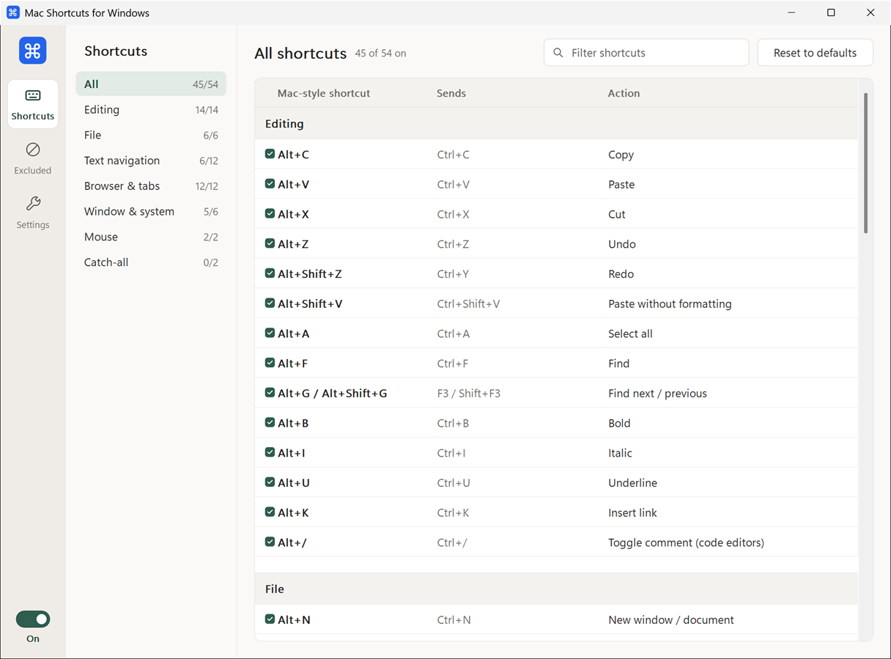

# Mac Shortcuts for Windows

**Website:** https://priomsrb.github.io/mac-shortcuts-for-windows/

**[Download the latest release](https://github.com/priomsrb/mac-shortcuts-for-windows/releases/latest)** (single file, no installer) · [All releases](https://github.com/priomsrb/mac-shortcuts-for-windows/releases)

Use macOS-style keyboard shortcuts on Windows: the **Alt** key (where ⌘ Cmd sits on a Mac keyboard) acts as Cmd, so **Alt+C** copies, **Alt+V** pastes, **Alt+Tab** still switches apps, and so on.

A tray app with a settings window where every shortcut can be switched on or off.


<p align="center">
  <picture>
    <source media="(prefers-color-scheme: dark)" srcset="docs/images/shortcuts-dark.png">
    
  </picture>
</p>

Please [raise](https://github.com/priomsrb/mac-shortcuts-for-windows/issues) an issue if you want more features, additional hotkeys, or to report bugs.

## Motivation

MacOS and windows use different keys for shortcuts. When switching between them, it can be confusing for your muscle memory. By having the same shortcuts in both OSes you can avoid this problem.

Prior to this app, I was using AutoHotkey to set this up. But it had some downsides:

- No UI
- Difficult to configure
- Needs to be turned off when playing certain games. Some games treat Autohotkey as a cheating software.

## Usage

- Left-click the tray icon to open the window; right-click for **Settings**, **Enabled**, **Restart as administrator** and **Exit**.
- The window's rail switches between three pages, with an on/off switch for all remapping at the bottom:
  - **Shortcuts**: every shortcut by category, with a filter box. Tick or untick each one.
  - **Excluded apps**: apps where nothing is remapped (e.g. `mstsc.exe`). Type a process name, pick a running app or browse for an `.exe`.
  - **Settings**: Start with Windows (launches minimized at sign-in), which Alt keys act as ⌘ Cmd, the theme (System follows Windows' light/dark app mode, including live changes) and restarting as administrator.
- Closing the window keeps the app running in the tray.
- Settings are stored in `%APPDATA%\MacShortcuts\settings.json`.

## Notes

- **Admin apps:** Windows blocks non-admin apps from sending keys to elevated windows (Task Manager, admin terminals). Use **Restart as administrator** if you need shortcuts there. Start with Windows always launches without admin.
- **Right Alt / AltGr:** on layouts with AltGr (e.g. German, French), remapping Right Alt replaces AltGr characters like €. Untick **Right Alt acts as ⌘ Cmd** if you need them.
- Tapping Alt on its own still behaves normally (e.g. focuses the menu bar).

## How it works

A low-level keyboard hook (`WH_KEYBOARD_LL`) runs on a dedicated thread. Alt key-downs pass through untouched so unmapped combos keep working. When a mapped key is pressed, the key is swallowed, Alt is released logically (after tapping an unassigned "mask" key so the menu bar doesn't activate), and the replacement keys are injected with `SendInput`. The decision logic is in [RemapEngine.cs](src/MacShortcuts/Remapping/RemapEngine.cs), separate from the Windows hooks so it can be unit tested.

## Build & run

Requires the [.NET 10 SDK](https://dotnet.microsoft.com/download).

```bash
dotnet run --project src/MacShortcuts
```

Standalone `.exe` (a ~2.5 MB native binary; no .NET install needed on the target machine):

```bash
dotnet publish src/MacShortcuts -c Release -r win-x64 -o publish
```

This uses [Native AOT](https://learn.microsoft.com/dotnet/core/deploying/native-aot/), which also needs the Visual Studio **Desktop development with C++** workload (or the C++ Build Tools) for the linker. With the VS 2019 Build Tools, run it from PowerShell or cmd with `%ProgramFiles(x86)%\Microsoft Visual Studio\Installer` on `PATH`; otherwise the linker lookup fails with "'vswhere.exe' is not recognized".

## Development

- `dotnet test`: unit tests for the remapping logic, shortcut catalog and settings.
- `tools/smoke-test.ps1`: with the app running, opens a test window and simulates shortcuts to verify the remapping end to end.
- `tools/generate-icon.ps1`: regenerates `src/MacShortcuts/app.ico`.

## Releasing

Add user-facing changes to the `Unreleased` section of `CHANGELOG.md` as you go (or leave it empty to pre-fill from commit subjects), then run:

```bash
pwsh tools/release.ps1
```

It asks for the version bump, lets you edit the release notes, and offers a dry run before doing anything. The real run bumps `<Version>` in the csproj, rolls the changelog, commits, tags `vX.Y.Z` and pushes. The tag starts `.github/workflows/release.yml`, which tests, builds the exe and creates the GitHub release with it attached.

## Built with AI

This app was written with [Claude Code](https://claude.com/claude-code). I don't have much experience building windows apps so it would've been difficult to make this myself.

Feel free to contribute code or fork this project for your own use.

## License

[MIT](LICENSE)
